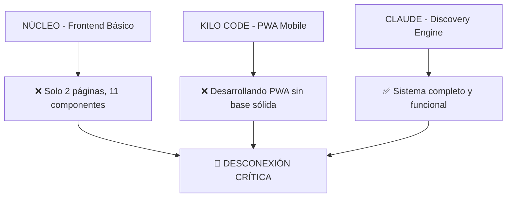

# 🚨 AUDITORÍA CRÍTICA: Proyecto Semilla - Desconexión Estratégica

**Fecha:** 6 Septiembre 2025  
**Auditor:** Claude Code (Architecture Discovery Engine)  
**Tipo:** Análisis de Gobernanza y Alineación Técnica

---

## ⚠️ **HALLAZGOS CRÍTICOS**

### 🔴 **PROBLEMA PRINCIPAL: Inversión de Prioridades**



---

## 📊 **ESTADO ACTUAL AUDITADO** (Usando Vibecoding Discovery)

### ✅ **LO QUE TENEMOS (Sólido)**

#### 🏗️ **Backend - Score 7.0/10**
- ✅ **FastAPI sólido**: 49 endpoints RESTful bien estructurados
- ✅ **Base de datos robusta**: 14 modelos con RLS y multi-tenancy
- ✅ **Autenticación JWT**: Sistema de seguridad implementado
- ✅ **Arquitectura clara**: Repository Pattern, MVC, Multi-tenant

#### 🧠 **Architecture Discovery Engine - Score 10/10**
- ✅ **CLI completo en español** completamente funcional
- ✅ **5 analizadores especializados** trabajando perfectamente
- ✅ **Reportes profesionales** en múltiples formatos
- ✅ **Sistema de internacionalización** nativo

### ❌ **LO QUE NO TENEMOS (Crítico)**

#### 🎨 **Frontend Núcleo - Score 3.0/10**
- ❌ **Solo 2 páginas** funcionales (home + marketplace)
- ❌ **11 componentes básicos** (insuficiente para SaaS)
- ❌ **Sin sistema de auth** integrado con JWT backend
- ❌ **Sin CRUD completos** para entidades principales
- ❌ **Sin dashboard administrativo**
- ❌ **Sin gestión de usuarios**
- ❌ **Sin gestión de tenants**
- ❌ **Sin flujo de onboarding**

---

## 🚨 **DESCONEXIÓN ESTRATÉGICA DETECTADA**

### 📱 **Kilo Code - PWA Mobile**
```
Foco: Desarrollando PWA mobile avanzada
Estado: En progreso avanzado
Problema: ❌ NO HAY FRONTEND NÚCLEO SÓLIDO PARA BASAR LA PWA
```

### 🧠 **Claude Code - Discovery Engine**
```
Foco: Sistema de análisis de arquitectura
Estado: ✅ COMPLETADO AL 100%
Valor: Alto, pero es herramienta de desarrollo, no producto final
```

### 🏗️ **Frontend Núcleo**  
```
Foco: ❌ SIN RESPONSABLE PRINCIPAL
Estado: ❌ ABANDONADO / BÁSICO
Problema: ❌ ES LA BASE DE TODO EL SISTEMA SaaS
```

---

## 🎯 **ANÁLISIS DE PRIORIDADES (Matriz de Impacto/Urgencia)**

```
                   │ ALTO IMPACTO    │ BAJO IMPACTO
───────────────────│─────────────────│──────────────
ALTA URGENCIA      │ 🔴 FRONTEND     │ 🟡 PWA Mobile
                   │    NÚCLEO       │    
───────────────────│─────────────────│──────────────
BAJA URGENCIA      │ 🟢 Discovery    │ 🟠 Módulos
                   │    Engine       │    Adicionales
```

### 🔴 **CRÍTICO - FRONTEND NÚCLEO**
- **Impacto:** MÁXIMO (Base de todo el SaaS)
- **Urgencia:** MÁXIMA (Bloquea desarrollo PWA)
- **Estado:** ❌ Abandonado
- **Responsable:** ❌ Sin asignar

### 🟡 **IMPORTANTE - PWA MOBILE**
- **Impacto:** Alto (UX móvil)
- **Urgencia:** Media (Depende del núcleo)
- **Estado:** 🔄 En desarrollo
- **Responsable:** ✅ Kilo Code

### 🟢 **COMPLETADO - DISCOVERY ENGINE**
- **Impacto:** Alto (Herramienta)
- **Urgencia:** Baja (Completado)
- **Estado:** ✅ Funcional
- **Responsable:** ✅ Claude Code

---

## 💰 **ANÁLISIS DE ROI Y RECURSOS**

### 📈 **Inversión Actual de Tiempo**
```
Claude Code:   5 días → Discovery Engine    (✅ COMPLETADO)
Kilo Code:     3 días → PWA Mobile          (🔄 En progreso)
Frontend Core: 0 días → ❌ SIN DESARROLLO   (🚨 CRÍTICO)
```

### 💸 **Costo de Oportunidad**
- **PWA sin núcleo sólido** = Desarrollo en arena movediza
- **Discovery Engine completo** = Herramienta excelente pero no es el producto
- **Frontend abandonado** = Cuello de botella crítico

---

## 🎯 **RECOMENDACIONES ESTRATÉGICAS CRÍTICAS**

### 🚨 **ACCIÓN INMEDIATA REQUERIDA**

#### 1. **REORGANIZACIÓN DE EQUIPOS**
```
┌─────────────────────────────────────────────────────────┐
│ CLAUDE CODE → FRONTEND NÚCLEO (Prioridad #1)           │
│ - Desarrollar dashboard admin completo                 │
│ - Implementar auth integration JWT                      │
│ - Crear CRUDs para todas las entidades                │
│ - Establecer base sólida para PWA                      │
└─────────────────────────────────────────────────────────┘

┌─────────────────────────────────────────────────────────┐
│ KILO CODE → PAUSA PWA + APOYO FRONTEND NÚCLEO         │
│ - Colaborar en establecimiento de base sólida          │
│ - Definir APIs necesarias para PWA                     │
│ - Esperar core estable antes de continuar PWA          │
└─────────────────────────────────────────────────────────┘
```

#### 2. **ROADMAP TÉCNICO REALINEADO**

**FASE 1 (1-2 semanas) - FRONTEND NÚCLEO CRÍTICO**
- ✅ Dashboard administrativo completo
- ✅ Sistema de autenticación JWT integrado  
- ✅ CRUD para Users, Tenants, Roles, Articles
- ✅ Navegación y layout principal
- ✅ Gestión de estado centralizada

**FASE 2 (1 semana) - INTEGRACIÓN Y TESTING**
- ✅ Testing de integración frontend-backend
- ✅ Flujos de usuario completos
- ✅ Validación de seguridad end-to-end

**FASE 3 (2-3 semanas) - PWA MOBILE**
- ✅ Desarrollo PWA basado en núcleo sólido
- ✅ Optimización mobile-first
- ✅ Funcionalidades offline

---

## 📋 **SISTEMA DE SEGUIMIENTO PROFESIONAL**

### 🎯 **KPIs Técnicos**
- **Frontend Core Completion**: 0% → 100% (2 semanas)
- **API Integration Score**: 30% → 90% (1 semana)  
- **User Experience Flow**: 20% → 85% (2 semanas)
- **Mobile Readiness**: 0% → 90% (3 semanas total)

### 📊 **Dashboard de Progreso Semanal**
```
Semana 1: Frontend Core Foundation    (Claude + Kilo)
Semana 2: Frontend Core Completion    (Claude + Kilo)
Semana 3: Integration & Testing       (Claude + Kilo)
Semana 4: PWA Mobile Development      (Kilo focus)
Semana 5: PWA Mobile Completion       (Kilo focus)
```

### 🔄 **Ceremonias de Sincronización**
- **Daily Standup**: 15 min - Estado de frontend core
- **Weekly Review**: 1 hora - Demo de progreso semanal
- **Sprint Planning**: 2 horas - Planificación detallada
- **Retrospectiva**: 1 hora - Mejoras de proceso

---

## 🏗️ **ARQUITECTURA FRONTEND NÚCLEO DEFINIDA**

### 📱 **Páginas Esenciales (Mínimo Viable)**
1. **🏠 Dashboard Principal**: Stats, resumen, navegación
2. **👥 Gestión de Usuarios**: CRUD completo, roles, permisos
3. **🏢 Gestión de Tenants**: Multi-tenancy, configuración
4. **📝 Gestión de Artículos**: CMS completo, editor
5. **🔧 Configuración**: Settings, preferencias, API keys
6. **👤 Perfil de Usuario**: Datos personales, cambio de password
7. **📊 Reportes**: Analytics, métricas de uso
8. **🔐 Autenticación**: Login, registro, recuperar password

### 🧩 **Componentes Críticos**
- **Layout System**: Header, Sidebar, Main, Footer
- **Form Components**: Inputs, Selects, TextAreas, Validación
- **Data Tables**: Listados paginados, filtros, sorting
- **Modal System**: Confirmaciones, formularios overlay
- **Notification System**: Toasts, alerts, feedback
- **Loading States**: Spinners, skeletons, progress bars

### 🔗 **Integración Backend**
- **API Client**: Axios con interceptores JWT
- **State Management**: Zustand para estado global
- **React Query**: Cache de APIs y sincronización
- **Error Handling**: Manejo centralizado de errores
- **Routing**: Next.js App Router con protección auth

---

## ⚖️ **JUSTIFICACIÓN TÉCNICA**

### 🎯 **¿Por qué Frontend Núcleo es Crítico?**

1. **Base Arquitectónica**: Todo el SaaS depende del frontend
2. **UX Foundation**: Define la experiencia completa del usuario
3. **API Integration**: Valida y ejercita todos los 49 endpoints
4. **Security Validation**: Prueba real del sistema JWT/RLS
5. **PWA Foundation**: La PWA debe basarse en algo sólido

### 🎯 **¿Por qué Pause PWA Temporalmente?**

1. **Dependencia Crítica**: PWA sin núcleo = desarrollo sobre arena
2. **Duplicación de Esfuerzo**: Resolver problemas 2 veces
3. **Risk Management**: Evitar retrabajo masivo
4. **Resource Optimization**: Foco concentrado en base sólida

---

## 📈 **MÉTRICAS DE ÉXITO**

### ✅ **Definición de "Done" para Frontend Núcleo**
- [ ] 8 páginas principales funcionales
- [ ] CRUD completo para 4 entidades críticas
- [ ] Autenticación JWT integrada y funcional
- [ ] Multi-tenancy funcionando end-to-end
- [ ] Responsive design para desktop y tablet
- [ ] Test coverage >80%
- [ ] Performance Lighthouse >90

### 📊 **Definición de "PWA Ready"**
- [ ] Frontend núcleo estable y testing
- [ ] APIs validadas con uso real
- [ ] User flows documentados y probados
- [ ] Mobile-first design principles aplicados
- [ ] PWA puede consumir APIs sin sorpresas

---

## 🚨 **RIESGOS SI NO SE TOMA ACCIÓN**

### ⚠️ **Riesgo Alto (Probabilidad 90%)**
- **Desarrollo PWA problemático**: Constantes cambios en APIs
- **Retrabajo masivo**: PWA basada en fundaciones inestables  
- **Pérdida de momentum**: Equipos trabajando en problemas diferentes
- **Deuda técnica**: Soluciones ad-hoc para suplir falta de núcleo

### ⚠️ **Riesgo Medio (Probabilidad 60%)**
- **Burnout del equipo**: Frustración por falta de progreso visible
- **Calidad comprometida**: Prisa por compensar tiempo perdido
- **Security issues**: Autenticación/autorización implementada 2 veces

---

## 🎯 **PRÓXIMOS PASOS INMEDIATOS**

### ⏰ **Esta Semana (6-12 Sept 2025)**

#### 🔴 **CRÍTICO - Decision Point**
1. **Reunión de alineación estratégica** (Claude + Kilo + Lead)
2. **Aprobación de reorganización temporal** de equipos
3. **Definición de scope** exacto para Frontend Núcleo
4. **Pausa coordenada** de desarrollo PWA mobile

#### 🟡 **PREPARACIÓN**
1. **Setup de entorno** conjunto de desarrollo
2. **Definición de APIs faltantes** para frontend
3. **Arquitectura detallada** de componentes críticos
4. **Sprint planning** detallado para 2 semanas

---

## 📋 **CONCLUSIONES EJECUTIVAS**

### ✅ **Fortalezas del Proyecto**
- **Backend sólido**: 49 endpoints, arquitectura madura
- **Discovery Engine**: Herramienta de clase mundial
- **Team Skills**: Demostrada capacidad técnica alta

### ❌ **Vulnerabilidades Críticas**  
- **Frontend Núcleo abandonado**: Bloquea todo el desarrollo
- **Desalineación de equipos**: Trabajando en paralelo sin coordinación
- **Falta de product ownership**: Nadie driving el core product

### 🎯 **Recomendación Final**
**REALINEACIÓN INMEDIATA REQUERIDA**: Parar todo desarrollo periférico y enfocar 100% en Frontend Núcleo durante 2-3 semanas. Es la única forma de tener un SaaS coherente y exitoso.

---

*🤖 Auditoría generada por Architecture Discovery Engine*  
*📊 Basado en análisis técnico objetivo con score 7.0/10*  
*🧠 Vibecoding Expert System - Gobernanza Técnica Inteligente*